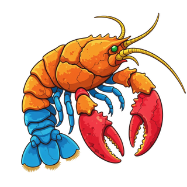

<div align="center">



# PaleoClaw 🦕

**An AI Research Agent for Paleontology · 古生物学 AI 研究助手**

<em>"Ex Fossilo, Scientia" — From Fossils, Knowledge · 源于化石，成就知识</em>

<p>
  <a href="https://github.com/syxscott/PaleoClaw/actions/workflows/ci.yml?branch=main"></a>
  
  = 22.12">
  <a href="LICENSE"></a>
  <a href="https://github.com/syxscott/PaleoClaw/stargazers"></a>
  <a href="https://github.com/syxscott/PaleoClaw/pulls"></a>
</p>

<p>
  <a href="https://www.paleoclaw.paleo-lab.com">🌐 Website</a> ·
  <a href="https://www.paleoclaw.paleo-lab.com/manual.html">📖 Manual</a> ·
  <a href="README_CN.md">🇨🇳 中文文档</a> ·
  <a href="CHANGELOG.md">📋 Changelog</a> ·
  <a href="https://github.com/syxscott/PaleoClaw/issues">🐞 Issues</a>
</p>

</div>

---

PaleoClaw is a domain-tuned AI research agent for paleontology, built on the [OpenClaw](https://github.com/openclaw/openclaw) agent runtime. It turns natural-language research questions into verifiable evidence: literature search with DOI-validated citations, fossil-database and stratigraphy queries, morphometric analysis, and a personal research profile — with every answer backed by primary sources.

PaleoClaw 是基于 OpenClaw 运行时的古生物学领域研究智能体：把自然语言的研究问题转化为可验证的证据——带 DOI 校验的文献检索、化石数据库与地层查询、形态测量分析、个人研究画像，每个结论都有原始文献支撑。

## ✨ Highlights

| | Capability | 说明 |
|---|---|---|
| 🔬 | **Domain tool suite** — PBDB fossil occurrences, taxonomy, stratigraphy, CrossRef/arXiv literature, 64-landmark morphometrics (DeepMorph-based) | 领域工具套件 |
| 🧠 | **Fenced memory** — short/long-term memory with vector retrieval, injected as a sanitized `<memory-context>` block that never leaks into replies | 围栏式记忆系统 |
| 👤 | **Dual-layer research profile** — `soul.md` (system identity) + `user.md` (your preferences) actually shape every run | 双层研究画像 |
| 💾 | **SQLite sessions** — WAL-backed history with FTS5 search, graceful JSON fallback, two-stage session titles | SQLite 会话存储 |
| 🗂️ | **Skills & pipelines** — curated research skills plus declarative pipelines with dependencies and a lifecycle curator | 技能与流水线 |
| 📱 | **Runs where you chat** — Telegram, Discord, WhatsApp, Slack, Signal, iMessage, LINE, Feishu and more via the OpenClaw channel layer | 多平台接入 |
| 🖥️ | **Control UI** — local web console for chat, sessions, usage and config | 控制台 UI |
| 🔬 | **Scientific integrity by design** — no fabricated data, verifiable DOIs, transparent uncertainty, reproducible queries | 科学诚信设计 |

## 🚀 Quick Start

**Prerequisites:** Node.js ≥ 22.12 · Git · curl

```bash
# npm (published package)
npm install -g paleoclaw@latest
paleoclaw onboard --install-daemon
```

<details>
<summary><strong>Alternative installs | 其他安装方式</strong></summary>

```bash
# pnpm
pnpm add -g paleoclaw@latest
pnpm approve-builds -g        # approve paleoclaw, node-llama-cpp, sharp, etc.
paleoclaw onboard --install-daemon
```

```bash
# Docker
git clone https://github.com/syxscott/PaleoClaw.git
cd PaleoClaw
./docker-setup.sh
```

```bash
# From source
git clone https://github.com/syxscott/PaleoClaw.git
cd PaleoClaw
pnpm install && pnpm ui:build && pnpm build && pnpm link --global
```

</details>

**Set up and go:**

```bash
paleoclaw profile init                                 # initialize research profile | 初始化画像
paleoclaw onboard --install-daemon                     # configure provider & model | 配置提供商
paleoclaw config set agents.defaults.model.primary "openai/gpt-5-mini"  # or set model directly | 直接设置模型
paleoclaw doctor                                       # verify installation | 验证安装
paleoclaw gateway --port 18789 --verbose               # start the gateway | 启动网关
```

```bash
# Your first research queries | 示例查询
paleoclaw agent --message "Find papers about Jurassic theropods"
paleoclaw agent --message "Query PBDB for Tyrannosaurus occurrences"
paleoclaw agent --message "What is the classification of Velociraptor?"
```

<details>
<summary><strong>Troubleshooting | 故障排除</strong></summary>

```bash
# Command not found | 命令未找到
node -v && npm prefix -g
export PATH="$(npm prefix -g)/bin:$PATH"

# Permission errors on Linux | 权限错误
mkdir -p "$HOME/.npm-global"
npm config set prefix "$HOME/.npm-global"
export PATH="$HOME/.npm-global/bin:$PATH"
```

</details>

## 🧪 Research Tools

| Tool | What it does | 数据来源 |
|------|--------------|----------|
| `pbdb_query` | Fossil occurrences, taxonomy, stratigraphy via the [Paleobiology Database](https://paleobiodb.org/) | PBDB |
| `crossref_search` | Literature metadata with DOI validation | [CrossRef](https://www.crossref.org/) |
| `literature_summary` | Multi-source aggregation (CrossRef · Semantic Scholar · arXiv) with citation formatting | 多源聚合 |

Morphometric analysis runs as a skill (`skills/morphometric_analysis/` — 64 landmarks, TPS/CSV/Excel/JSON export, MorphoJ & geomorph compatible, based on [DeepMorph](mailto:xkliu@cug.edu.cn)); PBDB/CrossRef context is injected into runs automatically by the auto-context layer (`PALEOCLAW_ENABLE_AUTO_TOOLS`).

```bash
paleoclaw paleo-tools list
paleoclaw paleo-tools run pbdb_query --params '{"baseName":"Allosaurus","limit":5}'
paleoclaw paleo-tools run crossref_search --params '{"query":"Jurassic theropod","rows":5}'
```

<details>
<summary><strong>Example output | 输出示例</strong></summary>

```
📄 Research Papers Found | 找到的研究论文:

1. The last dinosaurs: K-Pg boundary extinction patterns
   ├─ Authors: Smith, J., Johnson, K., Williams, R.
   ├─ Year: 2023
   ├─ Journal: Paleobiology
   ├─ DOI: 10.1016/j.palaeo.2023.111234
   └─ Citations: 42
```

</details>

## 🧠 Profile · Memory · Sessions

Your research profile (`~/.paleoclaw/soul.md` + `user.md`) and your accumulated memory are injected into every run as sanitized, fenced context blocks — the model sees them as background, never as instructions to echo.

```bash
paleoclaw paleo-memory status                  # memory overview | 记忆概览
paleoclaw paleo-memory search "tyrannosaurus"  # vector search | 向量检索
paleoclaw paleo-memory context "K-Pg event"    # build fenced context | 围栏上下文
paleoclaw paleo-session new --title "Jurassic Literature Review"
paleoclaw paleo-session search "K-Pg extinction DOI"
paleoclaw paleo-session resume <session-id>
```

<details>
<summary><strong>Full CLI reference | 完整命令参考</strong></summary>

```bash
# Profile | 画像
paleoclaw profile init            # initialize dual-layer profile | 初始化双层画像
paleoclaw profile show            # show current configuration | 当前画像配置

# Memory | 记忆
paleoclaw paleo-memory short      # list short-term | 短期记忆
paleoclaw paleo-memory long       # list long-term | 长期记忆
paleoclaw paleo-memory archive    # archive old memories | 归档旧记忆

# Tools | 工具
paleoclaw paleo-tools run crossref_search --params '{"query":"Jurassic theropod","rows":5}'

# Sessions | 会话
paleoclaw paleo-session list      # recent sessions | 最近会话
```

**Runtime switches | 运行时开关** (all default `true`):

```bash
PALEOCLAW_ENABLE_AUTO_TOOLS=true        # auto tool-context injection | 自动工具上下文
PALEOCLAW_ENABLE_MEMORY_CONTEXT=true    # memory fence injection | 记忆围栏注入
PALEOCLAW_ENABLE_SESSION_AUTOSAVE=true  # automatic session autosave | 会话自动保存
```

</details>

## 🖥️ Control UI & Channels

The repo ships the full OpenClaw-style control console (`ui/`) — chat, session history, usage dashboards and configuration in a local web UI, with wake-reconnect, composer drafts and per-session scroll memory. Messaging channels (Telegram, Discord, WhatsApp, Slack, Signal, iMessage, LINE, …) run in-tree; see [docs/channels/](docs/channels/) and [docs/index.md](docs/index.md).

## 🔬 Scientific Integrity | 科学诚信

<div align="center">

| 🔍 No Fabrication | 📚 Verifiable Citations | ⚠️ Transparent Uncertainty | 🔄 Reproducible |
|:---:|:---:|:---:|:---:|
| 不编造数据 | 可验证引用 | 透明的不确定性 | 可复现 |
| All data verified against primary sources | Every paper includes a valid DOI | Disputed data is clearly marked | All queries and parameters are logged |

</div>

## ⚙️ Configuration

<details>
<summary><strong>Environment variables & config file | 环境变量与配置文件</strong></summary>

**Provider & model** are configured by the `paleoclaw onboard` wizard, or directly:

```bash
paleoclaw config set agents.defaults.model.primary "openai/gpt-5-mini"
```

**Verified environment variables | 已验证的环境变量:**

```bash
# Profile paths | 画像文件路径
export PALEOCLAW_SOUL_PATH=/path/to/soul.md
export PALEOCLAW_USER_PATH=/path/to/user.md

# Data root override | 数据根目录覆盖（默认 ~/.paleoclaw）
export PALEOCLAW_HOME=/custom/data/root

# Integration switches | 集成开关（default: true）
export PALEOCLAW_ENABLE_AUTO_TOOLS=true        # auto tool-context injection | 自动工具上下文
export PALEOCLAW_ENABLE_MEMORY_CONTEXT=true    # memory fence injection | 记忆围栏注入
export PALEOCLAW_ENABLE_SESSION_AUTOSAVE=true  # session autosave | 会话自动保存
```

`~/.paleoclaw/paleoclaw.json`:

```json
{
  "agents": { "defaults": { "model": { "primary": "openai/gpt-5-mini" } } },
  "skills": { "load": { "extraDirs": ["~/.paleoclaw/skills"] } }
}
```

</details>

## 📁 Project Structure

<details>
<summary><strong>Repository layout | 仓库结构</strong></summary>

```
PaleoClaw/
├── skills/                           # Research skills | 研究技能
│   ├── paper_search/  pbdb_query/  taxonomy_lookup/  stratigraphy_lookup/
│   ├── paper_summary/  research_assistant/  morphometric_analysis/
│   └── screen_monitor/  activity_logger/  daily_log_generator/
├── src/
│   ├── paleoclaw/                    # Domain core | 领域核心
│   │   ├── profile/                  # soul.md + user.md layers | 双层画像
│   │   ├── memory/                   # task store + chat digests | 记忆与聊天日记
│   │   ├── session/                  # JSON + SQLite stores | 会话存储
│   │   ├── tools/ cli/               # domain tools & CLI | 工具与命令行
│   │   └── paths.ts
│   ├── skills/ tools/ toolsets/      # runtime skill/tool registry | 运行时注册表
│   ├── vendor/                       # vendored openclaw normalization-core + retry
│   ├── whatsapp/ telegram/ discord/ …# in-tree channels | 渠道
│   └── ui → ../ui                    # control console source | 控制台
├── ui/                               # Vite + Lit control UI | 控制台前端
├── apps/android/                     # companion Android app | 安卓伴侣应用
├── docs/                             # documentation | 文档
├── soul.md  user.md  PALEOCLAW_IDENTITY.md
└── CHANGELOG.md  README.md  LICENSE
```

</details>

## 📰 Release Highlights

<details>
<summary><strong>v1.8.0 (2026-09-08) — hardening & borrowed engines</strong></summary>

- **Fixed**: startup crash in `memory/index.ts` re-exports; unhandled-rejection crash path in the keyed async queue; LINE signature length handling; Discord embed validation; missing imports in session/task-memory stores; Android `Log` import and version naming; six dead help links and a strict-mode type error in the control UI.
- **Added**: SQLite session store (WAL + FTS5, self-repairing, JSON fallback) with two-stage session titles; chat-turn daily memory (ported from GeoClaw-OpenAI v3.2.4); skill lifecycle curator; declarative pipeline registry; vendored `normalization-core` + `retry` packages wired into PBDB/CrossRef fetches; wake-reconnect, composer drafts and scroll memory in the control UI; website i18n (zh/en/ja) + SEO infrastructure.

See [CHANGELOG.md](CHANGELOG.md) for the complete list.

</details>

<details>
<summary><strong>v1.7.0 (2026-06-02) — profile system correctness</strong></summary>

Focused bug-fix release: `splitSections` colon handling, `parseSoul` domain scope, safety boundaries, mission capture, and the `<paleoclaw-profile-context>` block that makes soul.md/user.md actually influence every run. See [CHANGELOG.md](CHANGELOG.md).

</details>

<details>
<summary><strong>v1.6.0 (2026-04-15) — tool / memory / session integration</strong></summary>

- Morphometric analysis: 64 landmarks (all semilandmarks), TPS/CSV/Excel/JSON export, MorphoJ & geomorph compatible, pure Node.js (based on DeepMorph)
- New CLI commands: `paleo-memory`, `paleo-tools`, `paleo-session`
- Fenced memory context (`<memory-context>`) injection

</details>

## 📚 Documentation

| Document | Description |
|----------|-------------|
| [使用手册 (Manual)](https://www.paleoclaw.paleo-lab.com/manual.html) | Full deployment & usage manual | 完整使用手册 |
| [README_CN.md](README_CN.md) | 中文文档 |
| [CHANGELOG.md](CHANGELOG.md) | Version history | 版本历史 |
| [docs/channels/](docs/channels/) | Channel integration guides | 渠道集成指南 |
| [DEPLOY_GUIDE (site)](https://github.com/syxscott/PaleoClaw_Web) | Website deployment | 官网部署 |

## 🤝 Contributing

Contributions welcome — new data sources, research skills, citation formats, language support, docs. Fork → branch → `pnpm test` → PR.

## 📜 License

**MIT** — see [LICENSE](LICENSE).

## 🙏 Acknowledgements

| Source | Provider |
|--------|----------|
| 🦕 Fossil occurrences & taxonomy | [Paleobiology Database (PBDB)](https://paleobiodb.org/) |
| 📚 Literature metadata | [CrossRef](https://www.crossref.org/) · [Semantic Scholar](https://www.semanticscholar.org/) · [arXiv](https://arxiv.org/) |
| 📐 Morphometric algorithms | [DeepMorph](mailto:xkliu@cug.edu.cn) — Xiaokang Liu @ CUG |
| 🦞 Agent runtime | [OpenClaw](https://github.com/openclaw/openclaw) |
| 🧠 Memory store design | [GeoClaw-OpenAI](https://github.com/whuyao/GeoClaw-OpenAI) |

## 📖 Citation

```bibtex
@software{paleoclaw2026,
  author = {PaleoClaw Contributors},
  title  = {PaleoClaw: An AI Research Agent for Paleontology},
  year   = {2026},
  url    = {https://github.com/syxscott/PaleoClaw}
}
```

Data source: Paleobiology Database (PBDB) — https://paleobiodb.org/

## 🔗 Support & Community

| Channel | Link |
|---------|------|
| 🐛 Bug reports & features | [GitHub Issues](https://github.com/syxscott/PaleoClaw/issues) |
| 💬 Community Q&A | [GitHub Discussions](https://github.com/syxscott/PaleoClaw/discussions) |
| 📧 Support | [support@paleoclaw.ai](mailto:support@paleoclaw.ai) |

---

<div align="center">

### 🦕 PaleoClaw — An AI Assistant for Paleontological Research

<em>"Ex Fossilo, Scientia" — From Fossils, Knowledge · 源于化石，成就知识</em>

<sub>Built with ❤️ by the PaleoClaw Team</sub>

</div>
